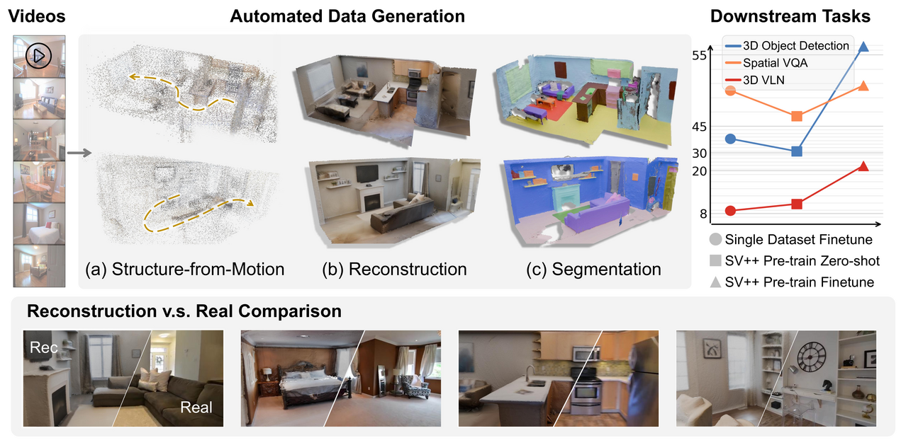

<div align="center">

<h2 align="center" style="font-size:24px;">
  <b>Lifting Unlabeled Internet-level Data for 3D Scene Understanding</b>
  <br>
  <b><i>CVPR 2026 </i></b>
</h2>


[](https://sv-pp.github.io/)
[](https://arxiv.org/abs/2506.07491)
[](https://huggingface.co/datasets/bigai/SceneVersepp)



</div>

## TL;DR

Annotated 3D scene data is scarce. We build an automated data engine that lifts web videos into structured 3D supervision — instance-level point clouds, object layouts, spatial VQA, and vision-language navigation — and show through experiments that this generated data has strong potential to supplement the broad 3D scene understanding.

## What's in this repo

This is the public release of the training code and data pipeline from the paper.

| Directory | Purpose |
| --- | --- | 
| [`PQ3D/`](PQ3D/) | 3D instance segmentation training | 
| [`SpatialLM/`](SpatialLM/) | 3D object detection training |  
| [`data_processing/`](data_processing/) | Video download, frame extraction, camera-pose visualization for the SVPP dataset | 

<!-- ## Roadmap

- [x] 3D detection training code (SpatialLM)
- [x] 3D segmentation training code (PQ3D)
- [ ] Data generation from web video -->

## Quick start

### 1. Get the dataset

```bash
huggingface-cli download bigai/SceneVersepp --repo-type dataset --local-dir ./svpp
```

### 2. Set up the data-processing environment

The scripts in [`data_processing/`](data_processing/) (video download, frame extraction, pose visualization) use a light-weight environment defined by [`requirements.txt`](requirements.txt):

```bash
conda create -n svpp python=3.10 -y
conda activate svpp
pip install -r requirements.txt
```

> The training stacks under `PQ3D/` and `SpatialLM/` each have their own heavier environments. See their respective READMEs.

### 3. Process the raw videos

```bash
# Download YouTube videos referenced by each scene's data_info.json
python data_processing/download_videos.py ./svpp

# Extract raw and cropped frames into images/ and crop_images/
python data_processing/extract_images.py ./svpp

# (Optional) Visualize camera poses for one scene with Open3D
python data_processing/view_camera_poses.py ./svpp --scene-name bedroom_100_3o5KSzfdOSE
```

### 4. Train

Each training stack is independent and ships with its own `README.md`:

- [`PQ3D/README.md`](PQ3D/README.md) — segmentation data generation and two-stage training
- [`SpatialLM/README.md`](SpatialLM/README.md) — layout generation, pretraining, fine-tuning, inference, and evaluation


## Citation

```bibtex
@inproceedings{chen2026lifting,
  title     = {Lifting Unlabeled Internet-level Data for 3D Scene Understanding},
  author    = {Chen, Yixin and Zhang, Yaowei and Yu, Huangyue and He, Junchao and Wang, Yan and Huang, Jiangyong and Shen, Hongyu and Ni, Junfeng and Wang, Shaofei and Jia, Baoxiong and Zhu, Song-Chun and Huang, Siyuan},
  booktitle = {Proceedings of the IEEE/CVF Conference on Computer Vision and Pattern Recognition (CVPR)},
  year      = {2026}
}
```

## Acknowledgements

This repository builds on:

- [PQ3D](https://github.com/PQ3D/PQ3D)
- [SpatialLM](https://github.com/manycore-research/SpatialLM)
